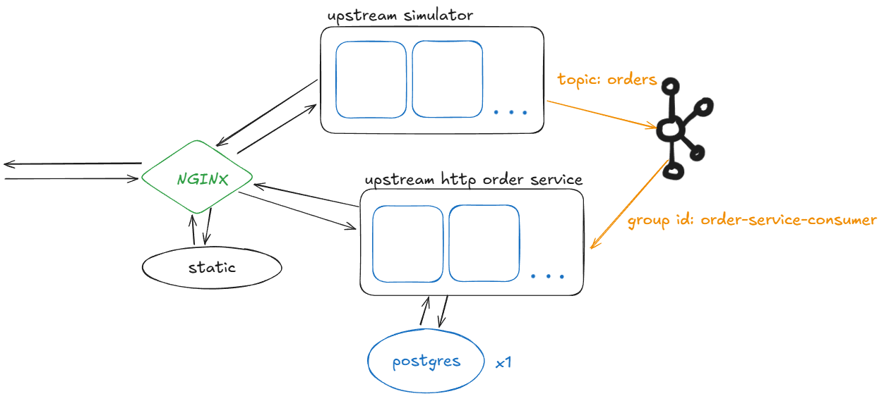

# Дияров Данис L0

### TODO

1. метрики (например, сколько данных кэшировано)
2. масштабирование
3. healthcheck

## Оглавление

* [Запуск](#запуск)
* [Тест](#тест)
* [Стек](#стек)
* [Архитектура](#архитектура)
* [Решения](#решения)
* [Структура проекта](#структура-проекта)
* [Валидация](#валидация)

## Запуск

1. Создайте в папке _./config_ файл _.env_, образец есть в папке
2. Для запуска

```bash
   make updb
   ```

3. Для остановки

```bash
   make down
```

### Другие команды

```bash
# команды docker compose
# буквы d и b означают флаги -d и --build
make up
make upd
make updb

# unit-тесты order_service
make test_orders

# golint для order_service
make lint_orders
```

## Тест

Как работают интеграционные тесты:

1. Запуск тестового окружения
2. Запуск по очереди контейнеров с тестами
3. Информация выводится в лог
4. Выкл

```bash
make test
```

### 1. E2E тест

1. создание 50 объектов
2. 3 секунды на сохранение
3. проверка, что они доступны, и повторный запрос проходит быстрее (кэш работает)

## Стек

| Тип технологии           | Название                                  |
|--------------------------|-------------------------------------------|
 **Язык**                 | Go                                        
 **Веб-библиотеки**       | ogen, net/http                            
 **Работа с БД**          | pgxpool, squirrel, go migrate             
 **БД**                   | Postgres                                  
 **Брокер сообщений**     | Kafka (confluentinc/cp-kafka) + Zookeeper 
 **Фронтенд**             | HTML/CSS, JS                              
 **Прокси/балансировщик** | Nginx                                     
 **Сервер статики**       | Nginx                                     

## Архитектура



## Решения

1. **Кэш** - Limited In-memory LRU, заполняется N значениями при запуске
2. **pkg и internal** - порты и адаптеры кэша и "получателя" (читателя) сделаны **Generic**
   и перенесены в **pkg**. Порты и адаптеры всего остального либо являются адаптированными типами
   под конкретно _Orders_, либо написаны с нуля (хранение, postgres), находятся в **internal**
3. **Specification first** - обработчик запросов сервиса заказов
   сгенерирована с помощью **ogen**.
4. **Vibecoding** - openapi, фронтенд, миграции (по json). К сожалению, всё
   пришлось править руками после GPT, так что оно не совсем вайб.
5. **Retry, fixed backoff** - "читатель" читает сообщения из kafka и если видит ошибку, не связанную
   с валидацией json, отправляет в retry. _Количество попыток_ и _fixed backoff seconds_ - в _.env_.
   Под капотом отправляет всё в канал с retry (вместо связного списка, который я тоже реализовал),
   сообщения из него имеют приоритет. **ВНИМАНИЕ РОФЛ**: если сообщение ещё не должно
   быть обработано (время не пришло), оно отправляется обратно в конец канала, и теоретически может
   висеть там часами (если навалится гора ретраев)
6. **Работа с БД** - пул pgxpool, запросы с отношениями 1:1 объединены в один, получение товаров в заказе
   отдельный запрос (-ы). Без ORM, миграции хранятся в папке с сервисом. **Из-за этого ./db/ должна быть,
   даже если БД не используется**
7. **Симуляция заказов** - есть отдельный сервис-симулятор, который написан непонятно как, игнорит мелкие ошибки
   и никак не структурирован. Он выполняет одну единственную функцию: отправка json в Kafka.
8. **Web** - создание и чтение заказов, пример json. Генерация рандомных json (навайбкожено).
9. **Линтер** - есть `golint` и `golangci-lint run`

## Структура проекта

| Папка                  | Значение                                                      |
|------------------------|---------------------------------------------------------------|
 **/api**               | папка со спецификациями                                       |
 **/build**             | папка с Dockerfile                                            |
 **/config**            | папка с .env (конфиги)                                        |
 **/docs**              | мелкая доп. документация                                      |
 **/integration_tests** | папка с окружением для интеграционных тестов и самими тестами | 
 **/nginx**             | файлы nginx: **статика, конфиг**; используется Docker Volume  |
 **/order_service**     | **основной сервис**                                           |
 **/simulator**         | простейший, просто braindead **симулятор сообщений** из Kafka |

```
C:.
│   .gitignore
│   architecture.png
│   docker-compose.yaml
│   Makefile
│   README.md
│
├───api
│   └───order_service
│           openapi.yml
│
├───build
│   ├───test_service
│   │       Dockerfile
│   │
│   └───universal_service
│           Dockerfile
│
├───config
│       .env
│       .env.example
│
├───docs
│       postgres.md
│       validation.md
│
├───integration_tests
│   │   .env
│   │   docker-compose.yaml
│   │
│   └───e2e_test
│           go.mod
│           go.sum
│           main.go
│
├───nginx
│   ├───conf.d
│   │       default.conf
│   │
│   └───static
│           404.html
│           index.html
│
├───order_service
│   │   generate.go
│   │   go.mod
│   │   go.sum
│   │
│   ├───cmd
│   │       main.go
│   │
│   ├───db
│   │   └───migrations
│   │           000001_init.down.sql
│   │           000001_init.up.sql
│   │
│   ├───internal
│   │   ├───api
│   │   │       oas_cfg_gen.go
│   │   │       oas_client_gen.go
│   │   │       oas_handlers_gen.go
│   │   │       oas_interfaces_gen.go
│   │   │       oas_json_gen.go
│   │   │       oas_labeler_gen.go
│   │   │       oas_middleware_gen.go
│   │   │       oas_operations_gen.go
│   │   │       oas_parameters_gen.go
│   │   │       oas_request_decoders_gen.go
│   │   │       oas_request_encoders_gen.go
│   │   │       oas_response_decoders_gen.go
│   │   │       oas_response_encoders_gen.go
│   │   │       oas_router_gen.go
│   │   │       oas_schemas_gen.go
│   │   │       oas_server_gen.go
│   │   │       oas_unimplemented_gen.go
│   │   │       oas_validators_gen.go
│   │   │
│   │   ├───config
│   │   │       config.go
│   │   │
│   │   ├───custom_errors
│   │   │       storage_errors.go
│   │   │
│   │   ├───handlers
│   │   │   └───httphandlers
│   │   │           handler.go
│   │   │           middlewares.go
│   │   │
│   │   ├───models
│   │   │       entities.go
│   │   │
│   │   ├───ports
│   │   │   │   ports.go
│   │   │   │
│   │   │   └───adapters
│   │   │       ├───cache
│   │   │       │       common_adapters.go
│   │   │       │
│   │   │       └───storage
│   │   │               postgres.go
│   │   │
│   │   ├───runner
│   │   │       http.go
│   │   │       order_recevier.go
│   │   │
│   │   ├───service
│   │   │       order_receiver_service.go
│   │   │       order_service.go
│   │   │
│   │   └───validators
│   │           validate_order.go
│   │
│   ├───pkg
│   │   ├───kafka
│   │   │       kafka.go
│   │   │
│   │   ├───linkedlist
│   │   │       list.go
│   │   │
│   │   ├───logger
│   │   │       logger.go
│   │   │
│   │   ├───pkgports
│   │   │   │   ports.go
│   │   │   │
│   │   │   └───adapters
│   │   │       ├───cache
│   │   │       │   └───lru
│   │   │       │           in_memory.go
│   │   │       │
│   │   │       └───receiver
│   │   │               kafka.go
│   │   │
│   │   └───postgres
│   │           postgres.go
│   │
│   └───tests
│           lru_test.go
│
└───simulator_service
    │   config.go
    │   go.mod
    │   go.sum
    │   handler.go
    │   kafka.go
    │
    ├───cmd
    │       main.go
    │
    └───db
```

### Валидация

См. docs/validation.md